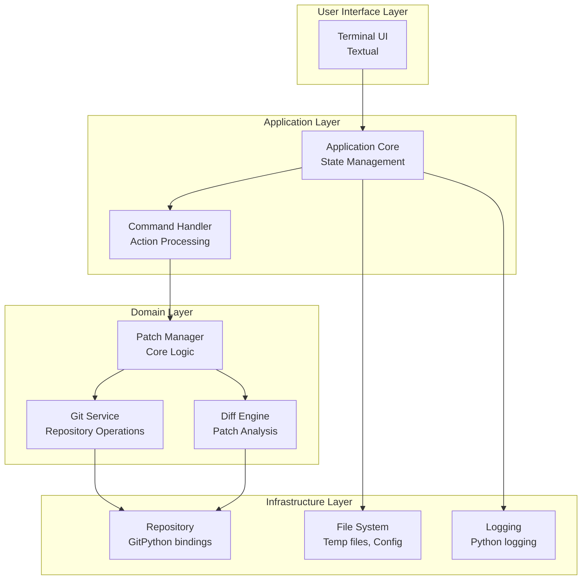

# Architecture Overview

Git Patchdance is designed as a modular system with clear separation of concerns, enabling both terminal and graphical interfaces while maintaining a robust core for git operations.

## System Architecture



## Core Components

### User Interface Layer

#### Terminal UI (TUI)
- **Framework**: Textual with async event handling
- **Layout**: Multi-pane interface with commit browser, patch viewer, and operation panel
- **Interaction**: Keyboard-driven navigation with intuitive keybindings
- **Features**: Syntax highlighting, scrollable views, modal dialogs, rich text rendering

### Application Layer

#### Application Core
Central state management and coordination between UI and domain layers.

**Responsibilities:**
- Application state management (current repository, selected commits, etc.)
- UI state synchronization
- Event routing and coordination
- Undo/redo history management

**Key Structures:**
```python
@dataclass
class AppState:
    repository: Optional[Repository]
    commit_history: list[CommitInfo]
    selected_commits: set[CommitId]
    patch_operations: list[PatchOperation]
    ui_state: UiState
```

#### Command Handler
Processes user actions and orchestrates domain operations.

**Responsibilities:**
- Action validation and preprocessing
- Operation queuing and execution
- Error handling and user feedback
- Progress tracking for long operations

### Domain Layer

#### Patch Manager
Core business logic for patch manipulation and git history operations.

**Key Operations:**
- Extract patches from commits (full or partial)
- Apply patches to target commits
- Create new commits from patch collections
- Validate and preview operations
- Handle merge conflicts

**Key Structures:**
```python
@dataclass
class PatchManager:
    git_service: GitService
    diff_engine: DiffEngine
    operation_history: list[Operation]

@dataclass
class MovePatch:
    from_commit: CommitId
    to_commit: CommitId
    patch_id: PatchId

@dataclass
class SplitCommit:
    commit: CommitId
    patches: list[PatchId]

@dataclass
class CreateCommit:
    patches: list[PatchId]
    message: str

Operation = Union[MovePatch, SplitCommit, CreateCommit]
```

#### Git Service
High-level git repository operations and state management.

**Responsibilities:**
- Repository detection and validation
- Commit traversal and filtering
- Branch and ref management
- Safe git operations with rollback capability

#### Diff Engine
Patch analysis, manipulation, and conflict resolution.

**Responsibilities:**
- Parse and analyze git diffs
- Extract individual file changes
- Support partial patch selection
- Detect and resolve conflicts
- Generate preview diffs

### Infrastructure Layer

#### Repository Layer
Low-level git operations using GitPython bindings.

**Responsibilities:**
- Direct git object manipulation
- Blob and tree operations
- Index management
- Reference updates

#### File System
Configuration and temporary file management.

**Responsibilities:**
- Application configuration
- Temporary patch files
- Operation state persistence
- Backup and recovery

## Data Flow

### Typical Operation Flow

1. **User Action**: User selects patches to move via UI
2. **Command Processing**: Action validated and queued
3. **Patch Extraction**: Source commits analyzed, patches extracted
4. **Preview Generation**: Changes previewed for user confirmation
5. **Operation Execution**: Git operations performed atomically
6. **State Update**: Application state refreshed, UI updated
7. **History Recording**: Operation recorded for undo capability

### Error Handling Strategy

- **Validation Layer**: Early validation of user inputs and git state
- **Atomic Operations**: All git changes performed as atomic transactions
- **Rollback Capability**: Automatic rollback on operation failure
- **User Feedback**: Clear error messages with suggested remediation
- **Recovery Mode**: Ability to recover from corrupted operation state

## Concurrency Model

- **Async Core**: All I/O operations are async using asyncio
- **Background Tasks**: Long operations run in background with progress updates
- **UI Responsiveness**: UI remains responsive during git operations using Textual's async framework
- **Cancellation**: Support for cancelling long-running operations

## Security Considerations

- **Repository Validation**: Verify git repository integrity before operations
- **Path Sanitization**: Sanitize all file paths to prevent directory traversal
- **Operation Limits**: Prevent operations on extremely large repositories
- **Backup Strategy**: Automatic backups before destructive operations

## Performance Considerations

- **Lazy Loading**: Load commit history and diffs on demand
- **Caching Strategy**: Cache frequently accessed git objects
- **Memory Management**: Efficient handling of large repositories
- **Incremental Updates**: Update UI incrementally for large datasets
