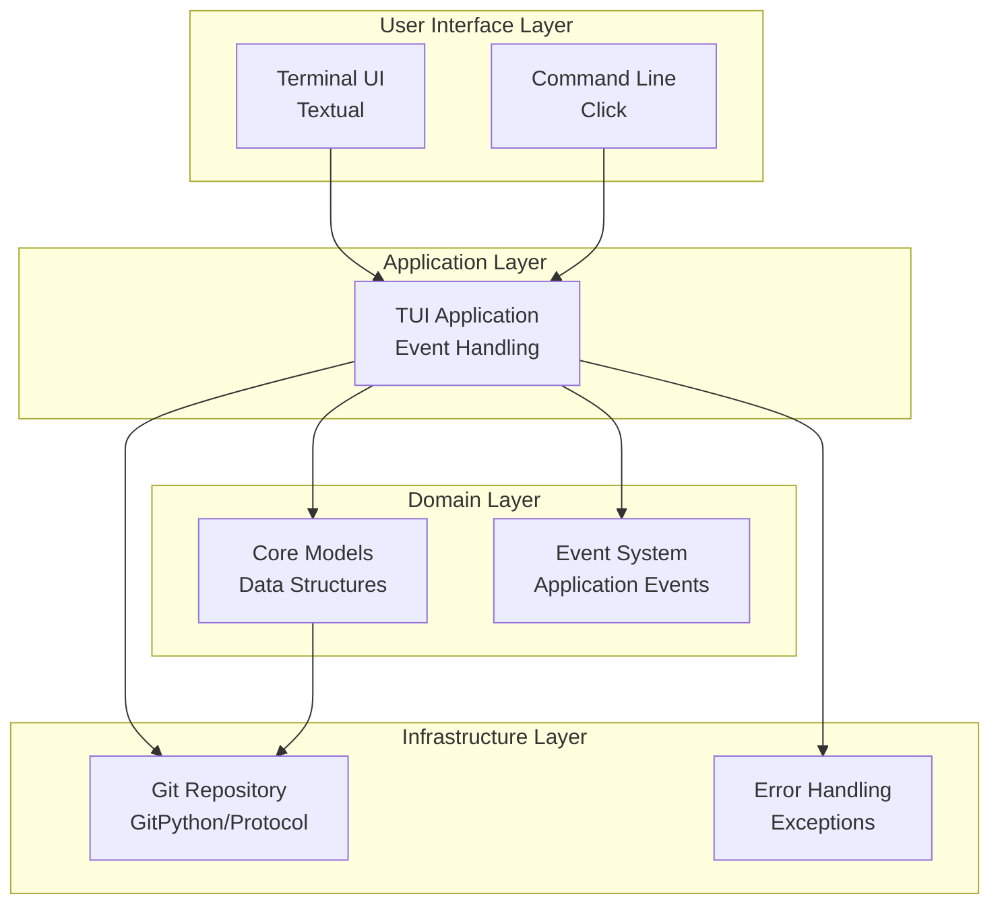

# Architecture Overview

Git Patchdance is designed as a modular system with clear separation of concerns, enabling both terminal and graphical interfaces while maintaining a robust core for git operations.

## System Architecture

## Core Components

### User Interface Layer

#### Terminal UI (TUI)
- **Framework**: Textual with async event handling
- **Layout**: Multi-pane interface with commit browser, patch viewer, and operation panel
- **Interaction**: Keyboard-driven navigation with intuitive keybindings
- **Features**: Syntax highlighting, scrollable views, modal dialogs, rich text rendering

### Application Layer

#### TUI Application
Main application logic using Textual framework.

**Responsibilities:**
- User interface state management
- Event handling and user interaction
- Integration with git repository
- Error handling and user feedback

**Key Features:**
- Async event handling with Textual
- Modern terminal UI components
- Keyboard-driven navigation
- Real-time repository updates

### Domain Layer

#### Core Models
Data structures for representing git concepts and application state.

**Key Models:**
- Repository information and metadata
- Commit history and branch information
- File changes and patch data
- Application state and UI data

#### Event System
Application event handling and coordination.

**Key Features:**
- Event-driven architecture
- Async event processing
- Decoupled component communication
- Error event handling

### Infrastructure Layer

#### Git Repository
Git repository abstraction and implementations.

**Responsibilities:**
- Repository detection and validation
- Commit and branch operations
- GitPython integration
- Repository state management

**Implementations:**
- GitPythonRepository: Production implementation
- FakeRepository: Testing implementation

#### Error Handling
Comprehensive error management and reporting.

**Responsibilities:**
- Exception hierarchy and types
- Error recovery and reporting
- User-friendly error messages
- Logging and debugging support

## Data Flow

### Typical Operation Flow

1. **User Action**: User selects patches to move via UI
2. **Command Processing**: Action validated and queued
3. **Patch Extraction**: Source commits analyzed, patches extracted
4. **Preview Generation**: Changes previewed for user confirmation
5. **Operation Execution**: Git operations performed atomically
6. **State Update**: Application state refreshed, UI updated
7. **History Recording**: Operation recorded for undo capability

### Error Handling Strategy

- **Validation Layer**: Early validation of user inputs and git state
- **Atomic Operations**: All git changes performed as atomic transactions
- **Rollback Capability**: Automatic rollback on operation failure
- **User Feedback**: Clear error messages with suggested remediation
- **Recovery Mode**: Ability to recover from corrupted operation state

## Concurrency Model

- **Async Core**: All I/O operations are async using asyncio
- **Background Tasks**: Long operations run in background with progress updates
- **UI Responsiveness**: UI remains responsive during git operations using Textual's async framework
- **Cancellation**: Support for cancelling long-running operations

## Security Considerations

- **Repository Validation**: Verify git repository integrity before operations
- **Path Sanitization**: Sanitize all file paths to prevent directory traversal
- **Operation Limits**: Prevent operations on extremely large repositories
- **Backup Strategy**: Automatic backups before destructive operations

## Performance Considerations

- **Lazy Loading**: Load commit history and diffs on demand
- **Caching Strategy**: Cache frequently accessed git objects
- **Memory Management**: Efficient handling of large repositories
- **Incremental Updates**: Update UI incrementally for large datasets
